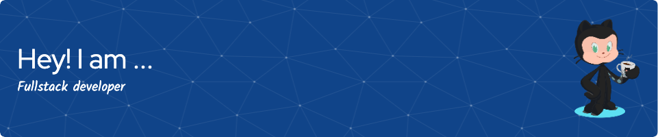

## Hi there 👋

Hi there! 👋 I'm Rafael, a passionate self-taught developer with a knack for solving problems and a love for learning new technologies. I embarked on my coding journey driven by curiosity and a desire to build impactful applications.

